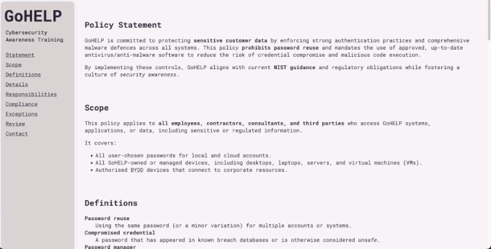
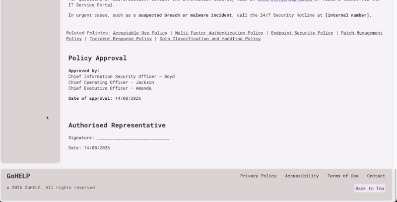

# TAFE Cert III IT — Unit 2

## GOHelp Cybersecurity Awareness Website

> A cybersecurity awareness training website I independently built from scratch alongside my TAFE coursework while learning web development.

### 🌐 [View the Live Website →](YOUR-GITHUB-PAGES-LINK)

For **TAFE Cert III in Information Technology — Unit 2**, my team developed a cybersecurity awareness project for **GOHelp**, a fictional organisation handling sensitive customer information.

The website component could have been created using a website builder, but I decided to **build my own version from scratch** as an opportunity to practise web development alongside my IT studies.

I'm currently learning **HTML, CSS, Git and GitHub**, so this project let me put those skills into practice on something connected to my actual TAFE coursework.

### Built With

- HTML
- CSS
- Git
- GitHub
- GitHub Pages

### Project Status

**Complete — deployed with GitHub Pages**

The cybersecurity content comes from the completed TAFE team project. The website itself was independently built by me as additional web development practice.
